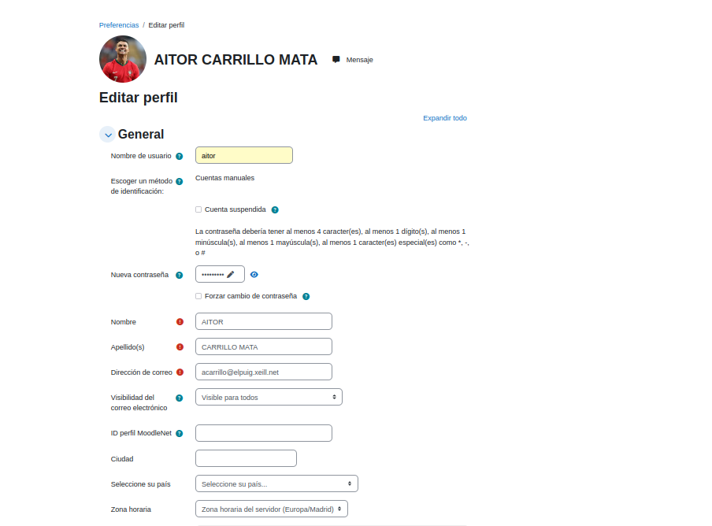

# manual-moodle
*1. Inicia sessió com a administrador i fes els canvis inicials:*

a. Modifica el teu correu, contrasenya i afegeix un avatar 

**(Perfil > Editar o Preferències)**.

b. Canvia el nom del lloc i configura la pàgina principal per ocultar contingut als no autenticats 

**(Administració del lloc > Primera plana > Paràmetres)**.
.png)

c. Comprova la franja horària 

**(Administració del lloc > Ubicació > Paràmetres)**.
.png)

d. Canvia l'idioma i activa la detecció automàtica 

**(Administració del lloc > Idioma > Paràmetres)**.
.png)

e. Modifica la política de contrasenyes perquè requereixin 4 caràcters amb majúscules, minúscules i números 

**(Administració del lloc > Seguretat > Normatives del lloc)**.
.png)

*2. Crea dos cursos:*
a. Curs A **(3 temes)**, Curs B **(5 temes)**

**(Administració del lloc > Gestiona cursos i categories > Afegeix curs)**.
.png)
.png)

*3. Edita un curs:*
**Afegeix un document PDF.**

**Modifica el títol d'un tema.**

**Explora opcions amb "Activar edició".**

.png)

*4.Crea usuaris:*

a. Afegeix manualment un usuari anomenat Bob 

**(Administració del lloc > Usuaris > Comptes > Afegeix un usuari)**.

.png)

b. Descarrega el CSV i edita com l'exemple i després importa 10 alumnes via CSV.

**(Administració del lloc > Usuaris > Comptes > Carrega usuaris)**
.png)

c. Elimina 2 alumnes 

**(Administració del lloc > Usuaris > Accions amb usuaris en bloc)**.
.png)

*5. Matricula usuaris als cursos:*
a. 
Fes que el **curs A** sigui públic sense inscripcions.
El **curs B** requereix registre manual d'usuaris.

**(Tendries que clicar en el guionet del costat d'usuaris matriculats i li dones ha mètodes de matriculació)**
.png)
.png)

b. 
Assigna Bob com a professor del **curs B** i matricula-hi els alumnes del CSV.

Comprova que el **curs A** és accessible sense autenticació i que el curs B requereix iniciar sessió.

.png)

*6. Modifica l'aparença del lloc:* 
Instal·la i activa un nou tema 

**(Administració del lloc > Connectors > Instal·lar complement)**.

Personalitza capçalera i peu de pàgina 

**(Administració del lloc > Aparença > Temes > Selector de temes)**.

.png)
.png)
.png)
.png)
.png)
.png)

*8. Afegir contingut al curs A com si fossis un professor:*

Crea activitats i recursos.

Afegeix una tasca que requereixi un fitxer PDF amb una data d'entrega oberta.

.png)
.png)

*CONTINGUTS*

*1. Crea una UF (Unitat Formativa):*

Afegeix una etiqueta amb el nom de la UF.

Mou els seus continguts cap a la dreta per agrupar-los.

*2. Dins la UF, crea 2 NF** **(Nuclis Formatius)***:*

Afegeix activitats i recursos dins de cada NF.

*3. Afegir activitats a la UF:*

Activitats magistrals: Pujada de materials **(PDFs, vídeos, etc.)**.

Activitats avaluables:

Entrega de fitxer **(Tasca on els alumnes enviïn un document)**.

Qüestionari **(Amb preguntes tipus test, resposta curta, etc.)**.

.png)
.png)

4. Per últim pots entrar al teu Moodle com a professor i pots modificar la nota dels teus alumnes.
   
.png)
.png)
.png)
